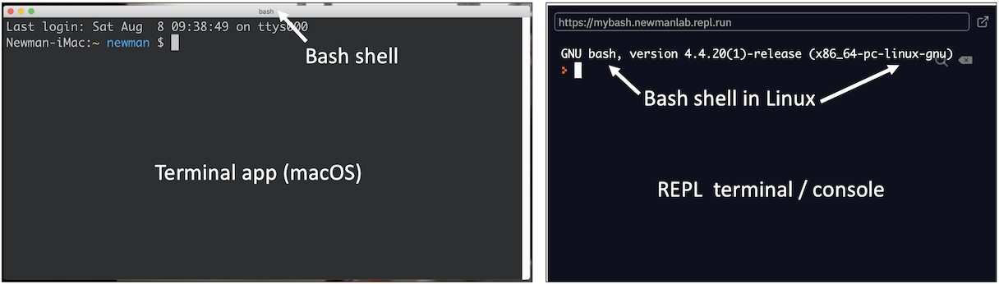
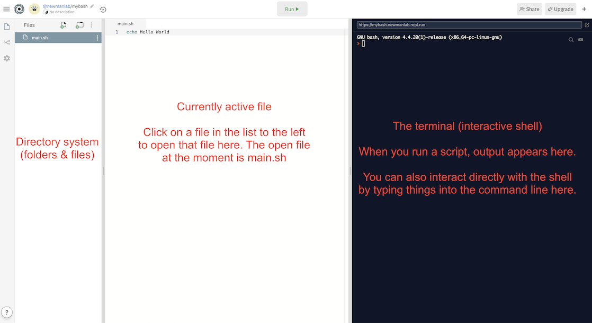
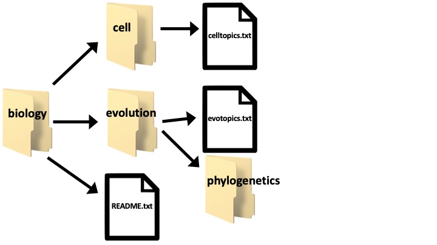

# Week 1: Command Line Basics

Here's a good [bash command reference guide](https://learncodethehardway.org/unix/bash_cheat_sheet.pdf) (PDF)

## Overview of OS and Command Line

**Operating system (OS)** - system software that manages computer hardware and software resources and provides common services for computer programs.
- Windows (Microsoft)
- Unix, OS X, macOS (Apple)
- Linux (Ubuntu, Mint, Fedora, etc.)

Linux/Unix is the preferred choice for most research in bioinformatics. It allows programmers to give [other] biologists easy access to dozens or hundreds of programs that work the same for all users on all machines.

How do we interact wih the OS?
- GUIs - graphical user interfaces: "point & click" menu interfaces/apps
- **Command line:** interface to interact with a program via text only (text input/output env)
	- **Terminal** or **Console:** the app (on Mac, Windows) to access the command line
	- **Shell:** command line interpreter (behind-the-scenes) - the programming language used to translate what you type into commands understood by the OS.
		- The intermediary between user and inner workings of OS.
		- Can be used _interactively_ (input from keyboard) or _non-interactively_ (input from file)
		- **Bash:** a type of shell (i.e., a programming language)



Why not just use a GUI?
- Not good for long sequences of operations that need to be repeated on multiple datasets.
- No log of what you did and what commands you executed.
- Not conducive to executing jobs remotely on a server.
- Labor-intensive to develop, and generally restricted to a single OS.

Use the command line!
- Extremely powerful.
- Absolute necessity for big datasets (most of modern biology).
- Automate tasks.
- Do & redo & redo & redo analyses with minimal added effort.
- Easy to record what you did, minimizing mistakes while enhancing repeatability and troubleshooting.

***!!! Important Warnings !!!***
- Shell commands are permanent. There's no undo. There's no recycle bin/trash.
- There are usually no warnings.
- If you **overwrite** a file, the original is gone forever.
- If you **delete** a file, it's gone forever.
- If you don't **back up your data**, it's your own fault.
- Make copies of your files before doing something drastic.
- You can make dummy (temp copy) files/folders and test commands on those first.
- As long as you're working in REPL, there's no chance of doing any damage to your own computer's OS because you will be coding in REPL's cloud system!

## Getting to Know repl

To create a new REPL, click the blue `+` in the top-right corner.
- Choose **Bash** language
- Name it **mybash**
- Click _Create repl_ and it should automatically load.

Here is an overview of your new repl:



The default bash script (`main.sh`) has 1 line, with the command `echo Hello World`. Let's RUN the script!
- Click the _Run_ button at the top. What output do you see in the terminal?
- What does the command `echo` do?
- `echo` works with/without `" "` around the text string.

Now let's run that same command by interacting directly with the command line.
- At the prompt (`>`), type the command `echo Hello World` and hit **Enter**/**Return**

## repl's Filesystem

We can add new files manually to our repl using the **Add File** button at the top of the filesystem pane:


Similarly, we can add folders manually with the **Add Folder** button.

## Filesystem Structure

Here is a visual of the filesystem we want to create in our repl. Go ahead and create these files and folders using the Add File/Folder buttons.



Here is how it looks in "directory" structure. Note the differences in notation between files (with filename extensions) and directories (end with `/`).

```
~/mybash/biology/
	README.txt
	cell/
		celltopics.txt
	ecology/
		ecotopics.txt
	evolution/
		evotopics.txt
		phylogenetics/
```
`~` is your user **home directory**
- In REPL, your home directory is `/home/runner`
- Your default working directory is the name of the REPL: `/home/runner/mybash`
- So everything we create in the Bash REPL should be in the `mybash` folder.

`pwd` = print working directory - or "where am I?"
- Shows your current working directory (where you currently are in the filesystem)

`cd` = change directory
- How to move around in the filesystem
- Accepts absolute and relative paths (see below)

**Absolute path** = path to directory or file from system root
- Typing the absolute path will get you to that location from anywhere in the system.
- Change directory to phylogenetics using its **absolute path:**

    ```
    cd /home/runner/mybash/biology/evolution/phylogenetics/
    ```

    ```
    # equivalent:
    cd ~/mybash/biology/evolution/phylogenetics/
    ```

Back to home directory: `cd ~`

**Relative path** = path to directory or file from **current working directory**
- `.` = current directory. It's usually optional when writing out relative paths.
- Go to phylogenetics using **relative path:**

    ```
    # First, know where you are by listing your current working directory (should be home).
    pwd

    # Go to phylogenetics
    cd mybash/biology/evolution/phylogenetics

    # equivalent:
    cd ./mybash/biology/evolution/phylogenetics
    ```

## Important Notes

The Unix root (`/`)
- The very base of the filesystem

Absolute paths
- All absolute paths begin at the root and so start with `/`
- The only exception is if you use `~` in place of `/home/runner` (because the equivalent of `~` starts with `/`, your absolute path still technically starts with `/`)

Relative paths
- Don't start with `/`
- Shortcuts for current and parent directories
- `.` - current directory
- `..` - step backwards one directory above current directory
	- Can you guess how to step backwards __two directories__ above current directory with a single command?

```
Filesystem Exercise

1. Imagine there's a folder named "popgen" inside the phylogenetics folder.
2. Write the absolute path to popgen.
3. Suppose popgen is your working directory. Write the relative path to phylogenetics.
4. Suppose biology is your working directory. Write the relative path to phylogenetics.
```

## Practical Computing Advice

#### Naming files and folders
- camelCaseLooksLikeThis
- underscores_are_good
- __NEVER__ use spaces!! Spaces confuse the system.
- Again, __NEVER. USE. SPACES. IN. FILENAMES.__ Repeat this over and over until it sinks in because this is VERY IMPORTANT.
- Generally a good idea to avoid special characters.

#### Plain text files
- Human readable
- ASCII and UniCode
	- [ASCII on Wikipedia](https://en.wikipedia.org/wiki/ASCII)
	- [UTF-8 on Wikipedia](https://en.wikipedia.org/wiki/UTF-8)
- Never ever ever write code in Microsoft Word or other word processor. Only use a plain-text editor. This isn't required for this class (yet?), but if you want to download a plain-text editor, use one of these:
	- Windows: [Notepad++](https://notepad-plus-plus.org/download/v7.6.2.html) (green "download" button)
	- Mac: [BBEdit](https://www.barebones.com/support/bbedit/updates.html) (if you don't already have TextWrangler installed)
		- OS 10.12.6 or later: v.12.5.2
		- If your OS is earlier than 10.12.6, get v.11.6.8

## Useful Tip!

The `up` arrow key steps back through your previous commands. This is very useful when you're using a particular command a lot.

## Attention to Detail

### Things that will quickly get you into trouble in this class

- Typos
- Incorrect punctuation
- Incorrect use of spaces
- Failure to use filename extensions (or the correct extension)

I cannot stress enough how urgent it is that you **very carefully proofread your code, always**. An error here and there is fine (even the most experienced programmers make typos!), _as long as you are able to recognize when you've made a typo (etc.) and are able to locate the error and correct it_. When I write up instructions for assignments, be sure you're following those instructions EXACTLY, including tiny but hugely critical details like filename extensions and capitalization. Those details ALWAYS matter. They may not seem important, but they are.

**I can't stress this enough: if you don't take the time to proofread your code and pay close attention to every single detail, it will be very hard to be successful in this class (and with coding in general).**

Coding is **much less flexible** than e.g., essay writing in terms of acceptability of typos and "grammar" (syntax) errors. Something that might be an insignificant grammar error in a language class usually translates to a fatal error in code. For example:

```
# What I tell you to type
cd ./biology

# What you actually type
cd /biology

# What happens?

# Recall that ./ is optional when telling Bash to look in current working dir.
# So this also works:
cd biology

# BUT you have to be able to recognize WHY these two are equivalent...
cd ./biology
cd biology

# ...but this one is different:
cd /biology
```

Even accidentally omitting just one period has fatal consequences in this case (and in most cases, unless it's part of a comment). In coding, punctuation is not optional, ever. That one period you left out doesn't just mean "pause" like in language grammar. That simple dot is a stand-in for "current working directory," and when you omit it, you're now telling Bash to look for the `biology` folder in the root directory (`/`). You'll get an error, because `biology` does not exist in `/`; it exists in `/home/runner/mybash`. When `/` is at the beginning of a path, it indicates `root`. When it's NOT at the beginning (even if the only character before it is `.`), it's simply a divider between directories. That's why `./biology` works ("current dir" / "biology") but `/biology` doesn't ("root" / "biology").

## Viewing Where You Are In the Filesystem

Recall: `pwd` shows your current working directory.

`ls` = show directory contents

`ls -l` - long list (list style)
- Everything has three types of permissions
	- Read (r)
	- Write (w)
	- Execute (x)
- And three groups whose permissions can be controlled
	- Owner (first set of 3)
	- Group (middle set of 3)
	- Everyone (last set of 3)
- **drwxr-xr-x** = directory, owner can r/w/x, group can r/x, everyone can r/x
- **-rwxr-xr-x** = file, owner can r/w/x, group can r/x, everyone can r/x
- [Wikipedia on Unix Permissions](https://en.wikipedia.org/wiki/File_system_permissions#Notation_of_traditional_Unix_permissions)

**Wildcards:** `*` is very useful! Matches anything!
- `ls *.txt` = show all files that end in .txt
- `ls ../*.txt` = show all txt files up one directory from where you are (note: this doesn't actually change your working directory)

## First Command Line Exercises

```
1. Change directories to biology
2. List the contents of the directory
3. Change directories to your home directory (remember the shortcut)
4. List the contents of the directory
```

## More Useful Commands Related to Files and Folders

### Creating, Moving, Copying

`touch filename.txt` - create a new empty file named **filename.txt**
- You must include extension in `touch` command.

`cp` = copies a file
- Copy file to new file in same directory:

    ```
    cp originalFile.txt newFile.txt
    ```

- Copy file and paste into parent directory:

    ```
    cp originalFile.txt ../newFile.txt
    ```

`mv` - moves __or__ renames a file
- To change location, use paths:

    ```
    mv myFile.txt folder/myFile.txt

    # You don't even have to retype the filename if only moving it:
    mv myFile.txt folder/
    ```

- To rename, just use different names:

    ```
    mv myFile.txt newName.txt
    ```

`mkdir myFolder` - create a new empty directory named myFolder

### Deleting

_**!!! WARNING - BIG WARNING - PAY ATTENTION!!!**_

`rm` _permanently_ removes a file - !!WARNING!! - YOU CAN'T UNDO THIS

`rmdir` - _permanently_ removes an empty directory - !!WARNING!! - YOU CAN'T UNDO THIS

`rm -r` recursively _permanently_ removes a directory and everything inside it - even more dangerous than just `rm`!
- I've heard of people who've accidentally erased their entire computers using this command.
- This is the reason permissions are so important. If someone doesn't have write permissions on a file or folder, they shouldn't be able to delete it.
- Fortunately, because we're coding in REPL with files and directories stored in the cloud, there's no danger of accidentally wiping important things from your computer with a bad command.

### Viewing File Contents

`cat filename.txt` - view file contents - can be called on multiple files and will conCATenate their contents

`cat file1.txt file2.txt file3.txt` will show all files in command line
- Try it! Create these three files, add some text to each file, then run the command.
- What do you notice about the output text? (pay attn to spacing)

`cat *.txt` shows all text in files with the file ending .txt

`head -n #` - view the first # of lines of a file

`tail -n #` - view the last # of lines of a file

`less` - view the contents of a file a little at a time. Good way to scroll through big files.

`wc` - print out the length of a file in lines, words, characters
- Try it! What's the output?

    ```
    wc file1.txt
    ```

### Writing to Files

`>` - writes to (or over!) file
- If the file already has text, `>` will overwrite the current contents. Be careful! You can't undo this.

    ```
    echo "some text here" > myTextFile.txt
    ```

`>>` - appends to file
- This is the safer alternative. You can use `>>` even if the file is currently empty (no text).
- If the file is empty, `>` and `>>` have the exact same result.
- If the file already has text, `>` will overwrite it, but `>>` will append new text to the end of the file.
- So `>>` is always the safest way to write text to file.

    ```
    echo "more text here" >> myTextFile.txt
    ```

What this is actually doing is redirecting the output of a command (`echo` in our example) from the terminal to a file. So instead of showing the output on your terminal screen, the output is sent to the specified file so you can access it later. (Once you close the terminal window, all the text in the terminal is gone.)

This works for any command that normally outputs text to the terminal.

```
# Make sure you're in mybash
cd ~/mybash

# Show contents of biology
ls -l biology

# Show contents of biology and save output to file
ls -l biology >> biologyinfo.txt
```

Look at **biologyinfo.txt** now. What is the output?

## Commands Related to the Unix Environment

### Variables

Create a variable and assign it a value using `=`

```
myvar=2

# Note the spacing!!
# What happens with this?
myvar = 2
```

Print the value of a variable
```
myvar

# What happened?

# Ok, I remember we need to tell Bash to print with the command "echo":
echo myvar

# What happened?

# To print the VALUE of a variable, use $ in front of name:
echo $myvar
```

### Helpful Tips for Using Commands

Recall: `up` arrow key steps back through previously used commands.

`history` - shows the entire history of commands entered during current terminal session.
- Because we're coding in cloudspace and sometimes REPL disconnects after a period of staying idle, it might not show your full history if you've let it sit for a while.

`|` = pipe - sends the output of one command into the input of another command instead of printing it to screen.
- Located above backslash `\` on keyboard (use `shift`)

    ```
    # What do you think this series of commands will do?
    history | tail -n 5
    ```

## Lab 1 (Due Tuesday, Aug. 25, at 11:59 PM)

See Moodle for lab assignment.
