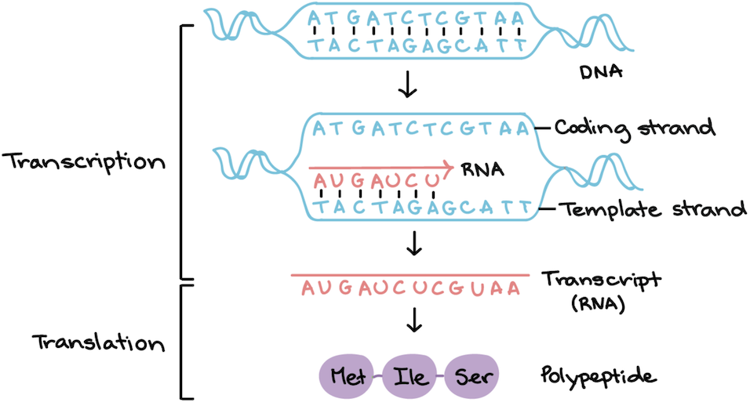

# Week 10: BioPython

### BioPython Resource

[BioPython Cookbook](http://biopython.org/DIST/docs/tutorial/Tutorial.html)

# Introducing BioPython

**BioPython** is an external (third-party) library that extends the built-in functionality of Python. BioPython has a huge array of tools for handling and processing sequence data and interacting with [NCBI GenBank](https://www.ncbi.nlm.nih.gov/genbank/).

The primary/main package of BioPython is the **Bio** package. And it has many **subpackages**, **modules**, and **submodules** (all similar concepts but differ in how they're structured within BioPython - don't worry about the differences).
- `Bio.Seq` - interact with sequence objects (nucleotide, protein)
- `Bio.SeqIO` - reading in sequence data (FASTA, FASTQ)
- `Bio.Align` - interact with alignment objects (alignment reformatting, etc.)
- `Bio.AlignIO` - reading in alignment data (nexus, phylip, etc.)
- `Bio.Blast` - interact with BLAST local or online, parsing BLAST results
- `Bio.Entrez` - interact with NCBI databases (Taxonomy, Pubmed, etc.)

## Importing packages

### Install BioPython package in repl

First, **install BioPython** by clicking on the **Packages** icon on the left sidebar (left of the files list), searching for "BioPython," and clicking the "+" button beside the package name.

### Importing modules

You already know how to import an external package (library): `import Bio`

But that's a very broad statement. Remember, BioPython is a _huge_ library. We're only going to be using a few modules/submodules at a time, so we don't need to import everything. Being more specific also allows us to use more concise language later in our script when calling functions from these external packages.

For example, we will be using the function `Seq()` that's part of the **Seq module** in the **Bio package**. Wow, what does all that mean?? Python packages are usually split into multiple .py script files, each containing a cohesive set of function definitions. This dramatically improves the streamlining of Python programs (packages). These definition files are called _modules_. To run a function that's in a different script file (module), you have to specify the package (if it exists), the module, and then the specific function. In the overall package named **Bio**, there's a module (script file) named **Seq.py**. That script file defines (among many other things) a function named **Seq()**.

So, if the beginning of our script only says `import Bio`, to use the `Seq()` function we'd have to use very convoluted language to call the function in our script: `Bio.Seq.Seq()`

Python allows us to make this much easier! If we know we're specifically going to be using the `Seq()` function in the `Seq` module, import it like this: `from Bio.Seq import Seq`
- You don't need to import Bio or Seq first. Python knows from that language to look in the Seq module of Bio for the Seq function.
- Now we can simply call `Seq()`!

# Bio.Seq

***!!! Important Note !!!*** Remember that capitalization always matters!

First, we need to import the Seq submodule from Bio: `from Bio.Seq import Seq`

Now we can assign a **Seq object** to a variable name:

```
from Bio.Seq import Seq

#instantiate Seq object
myseq = Seq("AGTACACTGGT")
```

Print `myseq` to see what it looks like.

In most cases, BioPython sequence objects behave just like Python strings do. Some examples:
- Get length of Seq object: `len(myseq)`
- Call upper/lowercase version: `myseq.lower()`
- Access specific elements with indexes: `print(myseq[0])`
- Count: `myseq.count("A")`
- Test if present: `"ACA" in myseq`

We can also iterate over the elements just like with a string:

```
for nucleotide in myseq:
  print(nucleotide)
```

We can also add Seq objects together just like with strings. Recall that using `+` does not add a space between the objects.

```
seq_of_As = Seq("AAAA")
seq_of_Ts = Seq("TTTT")

print(seq_of_As + seq_of_Ts)
```

## Methods unique to Seq objects

Seq objects also have their own unique methods that standard strings don't have. These are methods that apply specifically to nucleotide or protein sequences.

### Genetics review

First, if you don't remember the following concepts from genetics, go back and review them on your own.

**Base complements:** In a strand of DNA, adenine (A) pairs with thymine (T), and guanine (G) pairs with cytosine (C). The two strands are oriented in opposite directions (**antiparallel**).
- Upper ("sense") strand is oriented 5' to 3'
- Complementary ("antisense") strand is oriented 3' to 5'
- By convention, when given a sequence as text without notation, the 5' end is on the left (read the sequence left-to-right).

Complementarity of DNA strands makes it possible to use one strand as a template to construct the other (in DNA replication). This concept is also used in DNA transcription, which generates an RNA strand from a DNA template.

The **reverse complement** is simply the reverse of the complementary sequence. Reverse complements are useful when we want to keep our sequences oriented in the 5'-to-3' direction (remember, the complement is oriented 3'-to-5').
- Initial sequence, 5' to 3': AAGCTGC
- Complement, 3' to 5': TTCGACG
- REVERSE complement, 5' to 3': GCAGCTT

**Transcription** of a DNA sequence (**coding strand**) creates a single-stranded RNA transcript using the complement sequence (**template strand**). It's important that the complement is used because the polymerase adds nucleotides in the 5'-to-3' direction, which means it has to add from the 3' end of the template it's using. We want the RNA transcript to be the same sequence as the coding DNA strand (except replacing T with U).

**Translation** translates the RNA transcript into a protein using a translation table that converts each **codon** (set of 3 nucleotides) into an amino acid.



### BioPython methods

BioPython will do all of the above for us if we give it a DNA sequence (coding strand). All of these methods below are invoked on the Seq object containing the coding strand; they don't have arguments (keep empty parentheses).
- `.complement()` - generate complement
- `.reverse_complement()` - generate reverse complement
- `.transcribe()` - generate RNA transcript
- `.translate()` - generate protein sequence

```
#Coding strand
myseq = Seq("GGACATTTTCACCGT")

#Complement
myseq.complement()
#Out: "CCTGTAAAAGTGGCA"

#Reverse complement
myseq.reverse_complement()
#Out: "ACGGTGAAAATGTCC"

#Transcribe
myseq.transcribe()
#Out: "GGACAUUUUCACCGU"

#Translate
myseq.translate()
#Out: "GHFHR"
```

# Bio.SeqIO

**Bio.SeqIO** is the BioPython submodule for reading/writing sequence data.

Copy this text into a new file named **dnaseqs.fasta**. This is a FASTA file of 4 DNA sequences from 2 species:

```
>SpeciesA_seq1
AGCGCGCGCGTGTGT
>SpecesA_seq2
CCCCTTTTAAAATTT
>SpeciesB_seq1
ACACACACACACACA
>SpeciesB_seq2
CCGGTTCCGGTTCCT
```

Now let's work with the file.

```
from Bio import SeqIO

#Python standard open file in read-only mode
infile = open("dnaseqs.fasta", "r")

#Do sequence-specific stuff
#"fasta" is the file type
for record in SeqIO.parse(infile, "fasta"):
  print(record)
```

`SeqIO.parse()` returns a **SeqRecord** object. When we iterate over each sequence in the infile, we get all the SeqRecord objects.

We can access specific pieces of information in the SeqRecord object by invoking special methods on the object:
- `.seq` - the sequence
- `.id` - the sequence ID (sequence name is often the same as ID)

Let's continue the example from above:

```
for record in SeqIO.parse(infile, "fasta"):
  print(record.id, record.seq)
```

## Using parsed sequence records

**Note:** `.seq` is a Seq object (a sequence), so we can use it in all the ways we used a sequence that we created from scratch above - find the reverse complement, transcribe it, translate it, etc.

```
#Transcribe each sequence and print
for record in SeqIO.parse(infile, "fasta"):
  print(record.id, record.seq.transcribe())
```
## Writing sequence records to file

We can also write sequence records to files. (Importantly: BioPython can ONLY write out sequence records to files. It can't write out other strings or sequence objects.) This can be extremely useful... We often need to take a large FASTA file and copy subsets of sequences into new separate files. For example, our input FASTA file contains sequences from multiple species. Say we need to create a separate FASTA file for each species. We use some of the same concepts you've already learned: `if...else` statements to search.

Use this syntax to write a sequence record to file with `SeqIO.write()`:

```
SeqIO.write([record_variable_name], outfile_variable, "file_format")
```

The sequence record variable name must be in square brackets. Let's work with our example:

```
infile = open("dnaseqs.fasta", "r")
A_out = open("speciesA.fasta", "w")
B_out = open("speciesB.fasta", "w")

for record in SeqIO.parse(infile, "fasta"):
  if "SpeciesA" in record.id:
    SeqIO.write([record], A_out, "fasta")
  elif "SpeciesB" in record.id:
    SeqIO.write([record], B_out, "fasta")
  else:
    print("Extraneous sequence:", record.id)
A_out.close()
B_out.close()
```

# Creating a new sequence record

It's important to be able to convert a given sequence into a sequence record because **BioPython can only write out sequence records to files** (not sequence objects).

In addition to the sequence (.seq) and the sequence ID (.id), a sequence record also contains a **name** and a **description**. Name is often the same as id, but sometimes different depending on file type. We aren't going to work with names or descriptions, but when we create sequence records, we need to designate a null name and null description with `name = ""` and `description = ""`.

So our sequence record will contain the following information:
- Sequence (seq)
- ID (id)
- Name (for null, `name = ""`)
- Description (for null, `description = ""`)

Example:

```
from Bio import SeqIO
from Bio.SeqRecord import SeqRecord

for record in SeqIO.parse(infile, "fasta"):
  mrna = record.seq.transcribe()
  mrna_record = SeqRecord(mrna, id = record.id, name = "", description = "")
  print(mrna_record, "\n")
```

Here's an example where we create a new DNA sequence from scratch. Here, we have to go through several steps (yes, some of these steps can be combined):
1. Create string with DNA sequence.
2. Create sequence object from string.
3. Create sequence record from sequence object.
4. Write sequence record to file.

```
from Bio.Seq import Seq
from Bio import SeqIO
from Bio.SeqRecord import SeqRecord

#Create new sequence as string
seq_string = "ACGTACGT"

#Create sequence object from string
seq_object = Seq(seq_string)

#Create sequence record from sequence object
seq_record_object = SeqRecord(seq_object, id = "my_first_seq", name = "", description = "")

#Write sequence record to file
outfile = open("my_outfile.fasta", "w")
SeqIO.write([seq_record_object], outfile, "fasta")
outfile.close()
```
