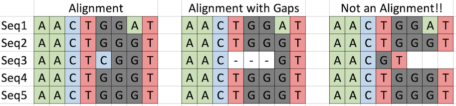
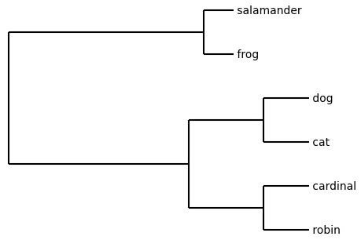

# Week 11: Phylogenetics

# DNA Sequence Alignments

Importantly, a **DNA sequence alignment** is not simply a list of sequences. It's not even just a list of sequences from the same gene. Specifically, an alignment is a list of sequences where each column in the alignment corresponds to the same position in the genome of all individuals in the alignment. In other words, a column is an orthologous base, inherited from a common ancestor. Because mutation often adds or deletes bases, many alignments contain **gaps** to keep the columns properly aligned.



## Importing an alignment

Let's import a sequence alignment! We will use the BioPython module **AlignIO** to read in the alignment from a file. We will be working with sequence alignments in **NEXUS format**.

Copy the entire text below and paste it into a new file in your repl named **data.nex**

```
#NEXUS
begin data;
 dimensions ntax=6 nchar=23;
 format datatype=dna;
 matrix
 robin AACGCTTACGGTGACCCCTGTAA
 cardinal AACTCATACGGTGACCGCTGTAA
 frog ATCCCTAAGGGCCTCGCCTCAAA
 salamander ATGCCTAAGGGCCTGGCCTCAAA
 cat CACGCTTTCGCTGACCGGTGTAT
 dog CACGGTTTCGCAGACCGGAGTAT

;
end;
```

Now let's import the alignment and save it as a variable named `aln`.

```
from Bio import AlignIO

aln = AlignIO.read("data.nex", "nexus")
```

Let's explore our alignment a bit! These methods are invoked on whatever variable is storing your alignment. Our alignment in this tutorial is saved as `aln`. Some of these methods are the same ones we used last week with standard (unaligned) DNA sequence files.

Alignment **length** - `.get_alignment_length()`

```
len = aln.get_alignment_length()
print("Alignment length:", len)
```

Just as with sequence files, each sequence in an alignment is imported as a **sequence record**. So we can access the record sequence and record ID using familiar methods:

```
for record in aln:
  print(record.id, record.seq)
```

# Reconstructing a Phylogenetic Tree

A **phylogeny**, or **phylogenetic tree**, is a depiction of the pattern of relationships among individuals, populations, or species. For more information on interpreting phylogenetic trees, see the PowerPoint slides on Moodle for this week.

There are several different ways to generate phylogenies that each make different assumptions about the data. _(Shameless plug: If you're interested in learning more about this, sign up for my Systematics class next semester!)_ The quick-and-dirty method we will use is **UPGMA** (unweighted pair group method with arithmetic mean). This method uses a **genetic distance matrix**, which is a pairwise matrix showing how similar each pair of sequences is; the more different the two sequences are, the higher the "distance" between them. Since we won't be reconstructing trees by hand in this course or doing any calculations, you don't need to know any more than that. In Systematics, we will go into all the details of what happens behind the scenes to go from sequences to distance matrix to tree. But for now, BioPython will do this for us!

## Part 1: create distance matrix

We are going to use BioPython (Bio) -> Phylo -> TreeConstruction -> DistanceCalculator.

Again, this is one place where you don't need to fully understand exactly what is happening behind the scenes here to use the tools. What we are doing below with this block of code:
1. Create a distance calculator that we will use in Step 2 to generate distance matrix under "identity" model.
2. Use distance calculator from Step 1 to create distance matrix.

```
from Bio.Phylo.TreeConstruction import DistanceCalculator

#Create distance calculator
calculator = DistanceCalculator("identity")

#Generate distance matrix from alignment using calculator
dm = calculator.get_distance(aln)
```

View the distance matrix using `print(dm)`.

## Part 2: generate phylogenetic tree

Now we will generate a phylogenetic tree based on the genetic distance matrix from Part 1 above.

To generate the tree, we will use Bio -> Phylo -> TreeConstruction -> DistanceTreeConstructor. To draw the graphical depiction of the tree, we will use Bio -> Phylo.

First, generate the phylogenetic tree using the distance matrix (which we saved as `dm` above). For some reason, Phylo automatically assigns names to the internal nodes on the tree, so we need to remove those internal ("nonterminal") node names.

```
from Bio.Phylo.TreeConstruction import DistanceTreeConstructor

#Generate tree
tree = DistanceTreeConstructor().upgma(dm)

#Remove internal node names
#This does permanently alter the tree object!
for node in tree.get_nonterminals():
  node.name = None
```

If you now print the tree, you will see that phylogenetic trees can be written in text form as a series of nested parentheticals. Technically, this is called **NEWICK** format. But generally this isn't very useful to us when we just want to visualize the relationships. So now let's draw the tree. First, we can "preview" the tree topology in the console window by drawing an ASCII text version of the tree with `Phylo.draw_ascii()`:

```
from Bio import Phylo

#Preview an ASCII text version of topology in console
Phylo.draw_ascii(tree)
```

Now, let's save the tree as an image to an image file that we can download.

We could run `Phylo.draw(tree)`, but that will open an interactive Matplotlib pane, and that's a headache to use in repl. `Phylo.draw()` uses the package Matplotlib to display the tree. Sometimes repl acts weird once you start using interactive plots (you may have to hit the Stop button to hard stop the process).

To eliminate the headache of dealing with the interactive plot pane, we can force Python to NOT display the tree by including `do_show=False` as an argument of `Phylo.draw()`. And when we want to draw the tree to a file instead, that step is necessary (I haven't been able to get the file saving to work in repl while the tree is displaying).

There are several things we need to do to get a good tree figure:
1. Draw tree (`Phylo.draw()`) but don't display it in interactive pane (`do_show=False`)
2. Turn off automatic plot axes (`pyplot.axis("off")`)
3. Save tree image to file (`pyplot.savefig("filename")`), and remove excess border whitespace where axes were (`bbox_inches="tight"`)

```
from Bio import Phylo
from matplotlib import pyplot

#Draw tree and don't display
Phylo.draw(tree, do_show=False)

#Disable axes
pyplot.axis("off")

#Save tree to image file
pyplot.savefig("tree.jpg", bbox_inches="tight")
```

The filename you specified above should now appear in the repl files pane. You can click on it and see the figure! For some reason, when I then download my repl and unzip the archive, that image file is missing. But you can actually download that one file directly by clicking on the file in the left sidebar to open it, then click the link at the top that says "Click here to download".

Here is our tree!



Our toy data shows that robin and cardinal (birds) are sister to each other, cat and dog (mammals) are sister to each other, and frog and salamander (amphibians) are sister to each other. The mammal clade and bird clade are more closely related than either is to the amphibian clade.

### Specify page size

If you have a tall tree with a lot of tips, the default output image dimensions will compress the tree so much that the tip labels overlap, making it unreadable. You can specify the output image dimensions in inches immediately after disabling the axes (or just before, doesn't matter, as long as it's before you savefig). Use `pyplot.gcf().set_size_inches(w,h)`, where w=width (for example: 8.5) and h=height (for example, 11).

# Entire Script

To make it easier to follow the above tutorial when creating your own script, here is everything we did above to import an alignment and generate a phylogenetic tree, as it would be written in a single script to run.

```
from Bio import AlignIO
from Bio.Phylo.TreeConstruction import DistanceCalculator
from Bio.Phylo.TreeConstruction import DistanceTreeConstructor
from Bio import Phylo
from matplotlib import pyplot

# Import alignment
aln = AlignIO.read("data.nex", "nexus")

# Create distance calculator
calculator = DistanceCalculator("identity")
# Generate distance matrix from alignment using calculator
dm = calculator.get_distance(aln)

# Generate tree and remove internal node names
tree = DistanceTreeConstructor().upgma(dm)
for node in tree.get_nonterminals():
  node.name = None

# Draw tree and don't display
Phylo.draw(tree, do_show=False)
# Disable axes
pyplot.axis("off")
# Set page size to width,height
pyplot.gcf().set_size_inches(8.5, 11)

# Save tree to image file
pyplot.savefig("tree.jpg", bbox_inches="tight")

```
