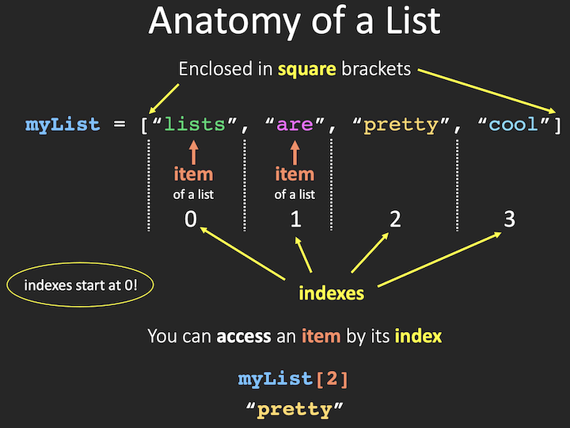
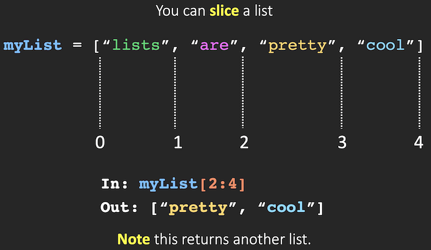

# Week 6: Lists and Iteration

## Readings
For this week, if you haven't already, take a look at:
- [Think Python, ch. 10: Lists](http://www.greenteapress.com/thinkpython2/html/thinkpython2011.html)
- [Think Python, ch. 4.2: for Loops](http://www.greenteapress.com/thinkpython2/html/thinkpython2005.html)

# Fruitful functions

First, a little more about functions. So far, we've been using functions that _do a thing_ - for example, multiplying and printing the result:

```
def do_multiplication(x,y):
  product = x * y
  print(product)
```

The above function doesn't return any value to use later in the script. It just does a thing. But other functions **return** a value to be used later - these are called **fruitful functions**.

For example, say we removed the print() line from our function definition because we don't need to print the result to the screen. Instead, we want to return the result of the multiplication (the value of `product`) and use that value later. In order for this to work, we have to tell the function to **return** the value (think of "return" as "save," sort of):

```
1  def do_multiplication(x,y):
2    product = x * y
3    return product
4
5  area = do_multiplication(10,15)
6  print("The area is", area, "sq cm")
```

This is what Python is literally doing when you run the above script:
1. **Lines 1-3:** Read in the definition of `do_multiplication()`
2. **Line 5:** Create new variable `area`
3. **Line 5:** Run `do_multiplication()` with arguments of 10 and 15 -> Go to Lines 1-3
  - **Line 2:** Multiply 10 by 15
  - **Line 3:** `return` -> bring that value back to where we left off -> Go back to Line 5
4. **Line 5:** Set value of variable `area` to result of `do_multiplication(10,15)`
5. **Line 6:** Print

Try the above code without the `return` line. (Delete the line numbers first; they're just for show.) What happens?

**Note:** In the above example, `product` is what we call a **local variable** - it's only defined and used WITHIN that function definition. If you try to call it anywhere else in this script, it won't work. That's why we can't just say `print(product)` outside of the function definition. It would work as part of the definition itself, of course, but usually we need to use the result of a function somewhere else in the script.

We'll come back to this later on.

# Lists

We've now covered the simple variable types in Python: integers, floats, and strings. There are several more complex types of variables that allow us to store and access multiple values. Perhaps the most versatile and common of these more complex types are **lists**.

Lists are always specified inside square brackets - `[]`

Lists can contain any number and type of simpler variables, but usually we want to use only one type in a list to not get confused.
- `list_of_ints = [2,1,4,3]`
- `list_of_floats = [3.14, 2.0, 12.3]`
- `list_of_strings = ["ecology", "evolution", "systematics"]`

## Modifying lists

After a list is created, it can be modified using **methods**. Unlike the string methods we learned, ***list methods do permanently change the value of the list variable***.
- **Add one** element: `.append()`

    ```
    list_of_ints.append(5)

    # Now look at list_of_ints
    # What does it contain now?

    # Another example
    list_of_strings.append("neurobiology")
    ```

- **Remove** one element: `.remove()`

    ```
    # Type the element itself, not its location in the list.
    list_of_ints.remove(5)
    list_of_strings.remove("ecology")
    ```

- **Add multiple** elements to existing list at once: `.extend()`

    ```
    # Set of new elements to add is itself a list
    list_of_ints.extend([5,6,7,8])

    # What happens if you accidentally use .append() here?
    list_of_ints.append([10,11,12])
    ```

If you accidentally use `.append()` to try to extend an existing list with >1 new element, you'll discover that it's possible to have a **list within a list**. Yes, lists can contain lists as elements!

In the previous example, `list_of_inits` now contains 8 integers and 1 list. Verify by printing `list_of_inits`
- integers: 2, 1, 4, 3, 5, 6, 7, 8
- list: [10, 11, 12]

Here's an example where we do this intentionally to create a list of lists:

```
# Create a new empty list
mylist = []

# Add a list to mylist
mylist.append([1,2,3,4])

# Add a second list to mylist
mylist.append([6,7,8,9])

# Add a third list to mylist
mylist.append([12,13,14,15])`
```

The variable `mylist` is now a list that contains 3 lists, each with 4 integers: **[ [1,2,3,4], [6,7,8,9], [12,13,14,15] ]**

# Indexing

You can view or extract parts of a list by using **indexes** and **slicing** the list. **Indexing** just means accessing specific elements in a list by referencing the location in the list.

***NOTE: Python starts counting at 0!***

- To select **ONE ITEM** in a list: indexes point to items.



- To select a **RANGE** of items in a list: indexes point to **slice** points.



```
# What values are returned here?
mylist = ["dog", "cat", "bird", "frog", "turtle", "lizard", "alligator", "salamander"]
print(mylist[4:7])
```

You can also alter individual elements of lists by using indexes:

```
mylist[2] = "bat"
print(mylist)
```

# Iteration with `for` loops

One of the nicest things about Python is the relationship between **lists** and `for` **loops**.

If you have an existing list, you can quickly iterate across all of its elements using this syntax:

```
for ITEM in LIST:
  thing to do with ITEM
  next thing to do with ITEM
```

**Important notes:**
- You can name "ITEM" anything you want as long as you call the same variable name later in the loop.
- Colon at end of `for` line.
- Code block in `for` loop must be indented.

```
mylist = ["dog", "cat", "bird", "frog", "turtle", "lizard", "alligator", "salamander"]

for animal in mylist:
  print("This creature is:", animal)
```

To iterate over a series of integers, use the `range()` function. Remember, Python starts at 0. Two ways to do this:

- `range(i)` - One argument = total number of iterations, starting with 0

    ```
    # Run loop 10 times, 0 through 9

    for num in range(10):
      print("This number is:", num)
    ```

- `range(i,j)` - Two arguments: start with i, end with j-1 (end "at" j, _not_ including j in the loop)

    ```
    # Run loop for 8 through 24, stopping at 25 (not running 25)

    for num in range(8,25):
      print("This number is:", num)
    ```

# Let's do an example!

Let's put this all together into an example. Let's write a function that loops through a list of integers to add 10 to the integer and append the result to a new list.

This is what we'll end up with:
- In: inlist = [1, 12, 46, 72, 210, 114, 5120]
- Out: outlist = [11, 22, 56, 82, 220, 124, 5130]

Start by making a backbone script - outlining the steps of the whole problem. Use comments because we aren't writing actual code yet.

```
# Define function that takes an integer and adds 10


  # Remember to return the value to use it later


# Define input list


# Create empty output list


# Loop through input list


  # Run addition function and append result to output list


# Print the output list
```

Now add in the actual code for each step and test run your script!

```
# Define function that takes an integer and adds 10
def do_addition(x):
  sum = x + 10
  # Remember to return the value to use it later
  return sum

# Define input list
inlist = [1, 12, 46, 72, 210, 114, 5120]

# Create empty output list
outlist = []

# Loop through input list
for num in inlist:
  # Run addition function and append result to output list
  outlist.append(do_addition(num))

# Print the output list
print(outlist)
```
